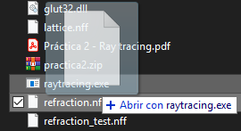
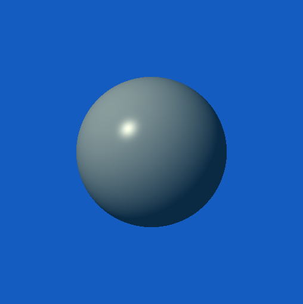
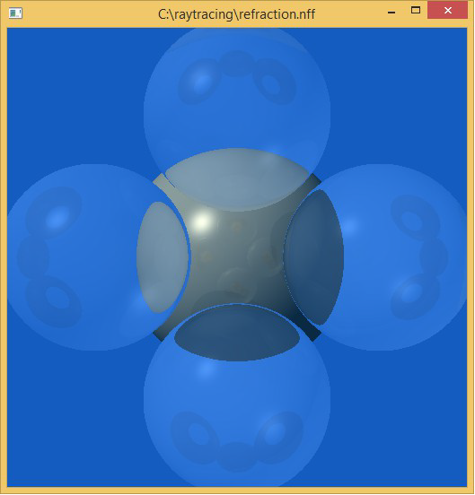
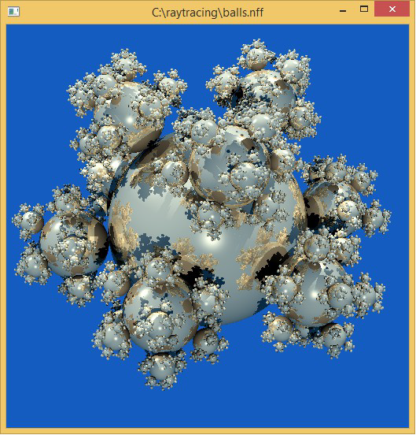
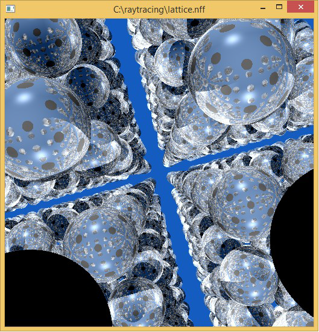

# Raytracing
Algoritmo de raytracing desarrollado para la asignatura de Realidad Virtual y Aumentada. 
El algoritmo implementa un modelo de iluminación global, añadiendo al modelo local de Phong la transmisión de luz y las componentes globales de iluminación, mediante un trazado recursivo de rayos.

## Como abrir un fichero:

 
Al abrir los ficheros .NFF con el ejecutable se obtienen resultados como los siguientes:

  

